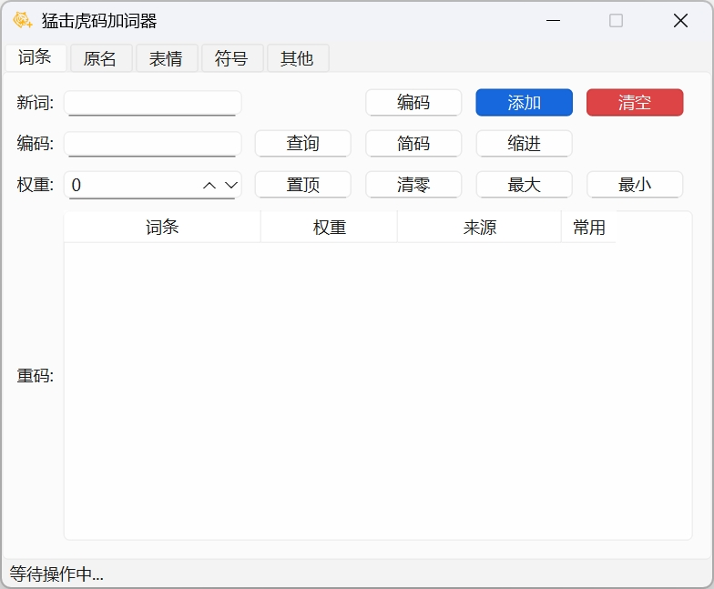
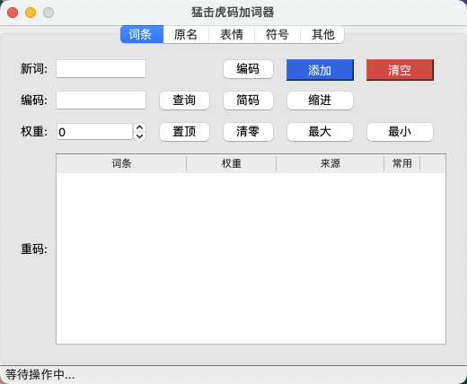
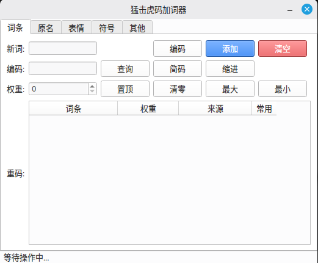

# 猛击虎码加词器

基于[虎码秃版](http://huma.ysepan.com/)方案的 Rime 加词器，允许根据码表结构调整配置。

## 功能

- 添加新词条或者为已有词条调频。
- 自动编码输入词条及其拼音。
- 查询编码所对应的重码项目。
- 可选地编码英文单词。
- 可选地编码简词。
- 可选地添加或调整表情(Emoji)滤镜。
- 可选地添加或调整符号(symbols)字典。

## 预览

### Windows

<!-- markdownlint-disable MD033 -->


### macOS



### Linux Mint



## 运行

### 运行打包的二进制文件

前往 [Releases](https://github.com/dragonish/huma-rime-adder/releases) 下载对应平台的压缩包，解压并运行二进制文件即可。

### 运行脚本源码

1. 安装 [Python 3](https://www.python.org/downloads/)。

2. 下载或者克隆(*需要安装 [git](https://git-scm.com/downloads)*)项目至本地：

    ```bash
    # 克隆项目
    git clone https://github.com/dragonish/huma-rime-adder.git

    # 进入项目目录
    cd huma-rime-adder
    ```

3. 运行以下命令安装程序依赖：

    ```bash
    python -m pip install -r requirements.txt
    ```

4. 运行以下命令启动程序：

    ```bash
    python main.py
    ```

## 用法

### 启动命令

- `-c, --config <config_file>`: 可选，设置配置文件路径。未指定时，默认尝试读取程序根目录下的 `config.ini` 文件。
- `-l, --log <log_level>`: 可选，设置日志级别。默认为 `INFO`。可选值有 `TRACE`、`DEBUG`、`INFO`、`WARNING` 和 `ERROR`。
- `-w, --work <work_dir>`: 可选，设置工作目录(码表文件所在目录)。默认为当前工作目录。
- `-i, --input <word>`: 可选，启动时直接编码的词条。

### 配置文件

可参照 `config.ini.template` 在程序目录下创建 `config.ini` 配置文件。

优先级：命令行参数 > 配置文件 > 默认值。

### 界面说明

#### 词条

在"新词"输入框中输入要添加的新词条，点击"编码"按钮或者按下回车键则自动编码并查询重码情况。

若需要添加简词，可以编辑"编码"输入框中的编码，然后点击"查询"按钮以查看此编码的重码情况。

可以根据重码情况或者调频需求调整待插入词条的权重值。

点击"添加"按钮将缓存新词条，可以连续添加多个词条。

关闭程序窗口后则会开始写入缓存的新词条至码表文件。若需要放弃此次修改，可切换至"其他"分页点击"强制退出"按钮。

最后重新部署输入法即可。

#### 表情

在"文本"输入框中输入要添加新表情的文本，点击"查询"按钮或者按下回车键则查询当前文本的表情列表情况。

在"表情"输入框中输入要添加的新表情，点击"插入"按钮将此新表情插入至表情列表。

可以在表情列表框内拖动排序、右键删除指定表情。

点击"完成"按钮将缓存表情列表。

关闭程序窗口后则会开始写入缓存的表情列表至滤镜配置文件。若需要放弃此次修改，可切换至"其他"分页点击"强制退出"按钮。

最后重新部署输入法即可。

#### 符号

在"编码"输入框中输入要添加新符号的编码(*不带前缀 `/`*)，点击"查询"按钮或者按下回车键则查询当前编码的符号列表情况。

在"符号"输入框中输入要添加的新符号，点击"插入"按钮将此新符号插入至符号列表。

可以在符号列表框内拖动排序、右键删除指定符号。

此外，可以在"注释"输入框内输入注释信息，这些注释信息最终会被写入在相应符号编码定义的上一行中。

点击"完成"按钮将缓存符号列表。

关闭程序窗口后则会开始写入缓存的符号列表至字典文件。若需要放弃此次修改，可切换至"其他"分页点击"强制退出"按钮。

最后重新部署输入法即可。

#### 其他

展示一些程序的相关信息。

- "整理拼音滤镜"按钮用于根据当前码表内容来覆盖并重写拼音词组滤镜配置文件。
- "强制退出"按钮用于强制退出当前程序，不进行任何写入与保存文件等操作。

### 程序退出代码

- `0` 表示程序正常退出。
- `1` 表示程序异常退出。
- `3` 表示程序正常退出但无实际写入文件操作。
- `4` 表示程序强制退出。
