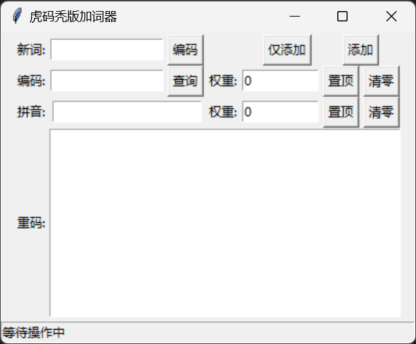

# huma-rime-adder

基于虎码秃版方案的 Rime 加词器。

## 功能

- 自动获取输入词条的编码和拼音。
- 查询编码所对应的重码项目。
- 快速插入词条至用户扩展码表和拼音码表中。
- 仅在文件末尾插入新词条，不改动文件原有内容。

## 预览



## 安装

1. 安装 [Python 3](https://www.python.org/downloads/)。

2. 下载或者克隆(*需要安装 [git](https://git-scm.com/downloads)*)项目至本地：

```bash
# 克隆项目
git clone https://github.com/dragonish/huma-rime-adder.git

# 进入项目目录
cd huma-rime-adder
```

3. 运行以下命令安装程序依赖：

```bash
# 通过依赖文件安装
python -m pip install -r requirements.txt

# 或者手动安装
python -m pip install loguru pypinyin
```

## 用法

启动程序：

```bash
# 运行：
python adder.py -w <码表文件所在目录>

# 或者将 adder.py 放置于码表文件所在目录下直接运行：
python adder.py
```

在"新词"输入框中输入要添加的新词条，点击"编码"按钮或者按下回车键则自动编码并查询重码情况。

若需要添加简词，可以编辑"编码"输入框中的编码，然后点击"查询"按钮以查看此编码的重码情况。

可以根据重码情况或者调频需求(*基于用户扩展码表的高优先级特性可实现覆盖调整词频*)调整待插入词条的权重值。

"仅添加"按钮在插入新词条后不关闭程序，以便连续添加；"添加"按钮则会在插入新词条后直接关闭程序。

完成新词条的添加后重新部署输入法即可。

## 命令

```bash
usage: adder.py [-h] [-l] [-w WORK]

虎码秃版加词器

options:
  -h, --help            show this help message and exit
  -l, --log             记录日志
  -w WORK, --work WORK  自定义工作目录
```
